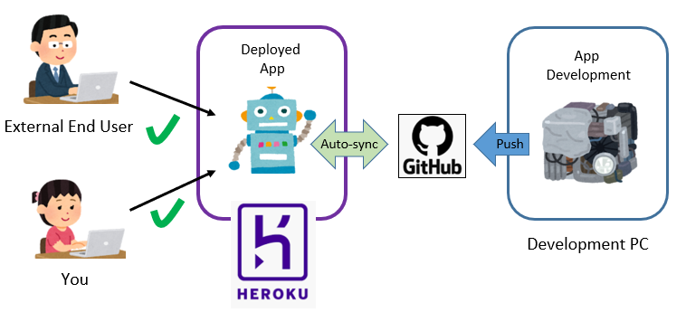

## Introduction

The purpose of this tutorial is to give you the knowledge needed to deploy your app on Heroku, and to integrate an automated deployment stage into your develompent pipeline.

DevOps has quickly become the norm when it comes to professional development environments. There are many stages in a DevOps oriented pipeline and one of the final stages is continous deployment. Of course, deployment can be done manually, however a dependable automization limits factors where things can go wrong. Limiting factors where something can go wrong is essential for sustainability reasons when dealing with larger projects and scaling up smaller ones. An automated deployment is therefore an integral part of any environment that has adopted a DevOps approach. 

This tutorial is designed for people who are somewhat familiar with github, and have little to no knowledge of heroku but want to deploy their app on a webb server or use heroku to auto deploy their app.

# What is Heroku?

Heroku is a cloud platform with support for many programming languages that allows developers to build, run and scale applications. Amongst other things, Heroku allows users to host their applications in virtual containers online, which can be navigated to using their unique URL.

## Learning Objectives

* How to deploy an app to Heroku
* How to integrate an automated deploy to your development pipeline
  
## Prerequisite Knowledge

* Basic familiarity with github

## Note

Although this tutorial does not address automated Continous Integration, it's highly recommended to implement this in your github repo before setting up an automated deploy as you can limit your auto deploy to only deploy if CI tasks have passed.
