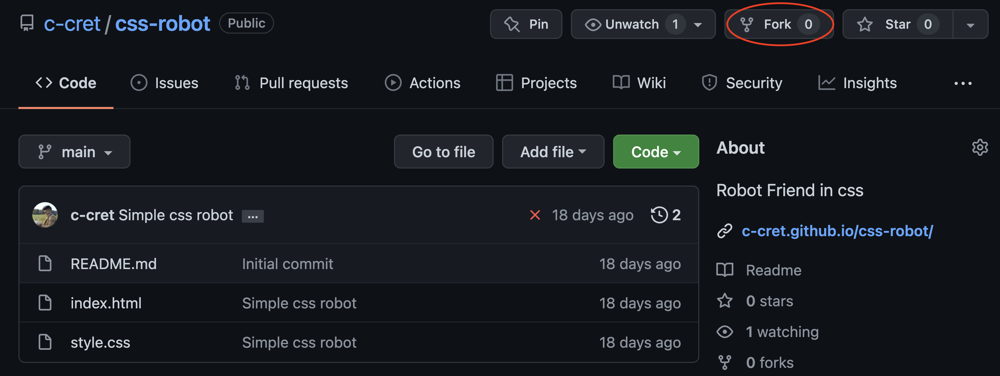
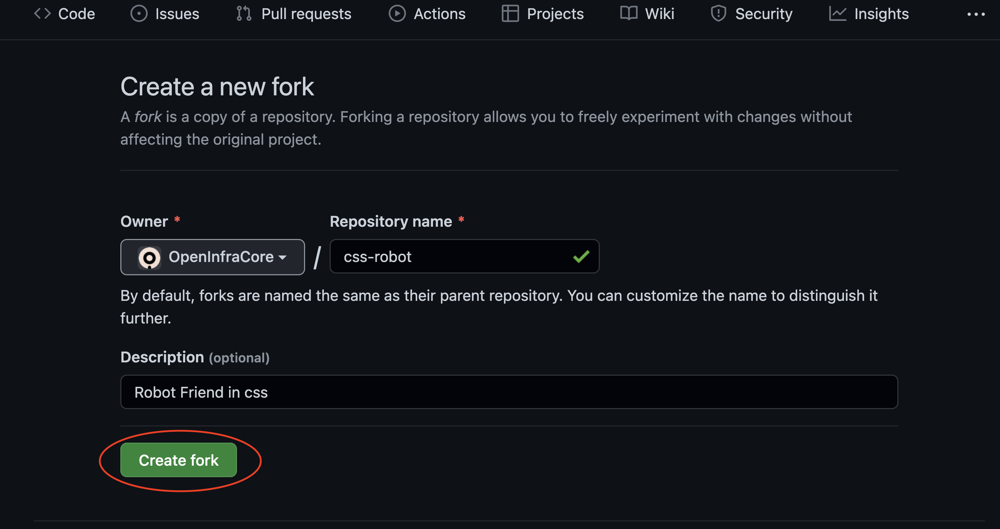
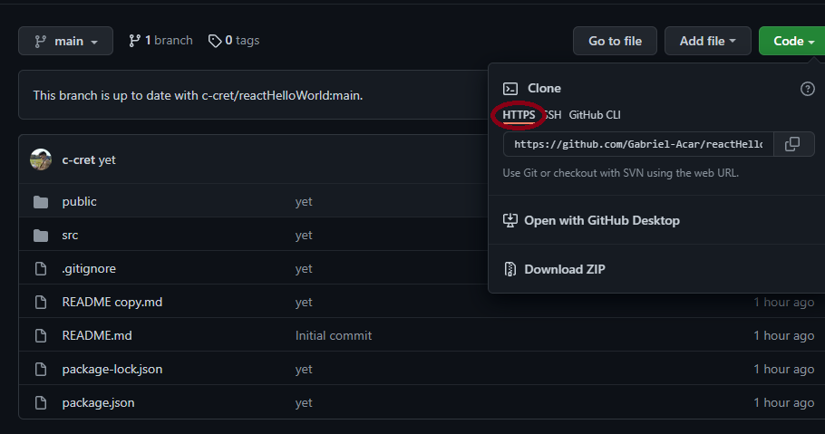

# Getting started 
In order to follow this totorial, you will need a Github repo that you want to deploy on Heroku. 
For simpliciy, and to make sure everything works as intended, we have prepare a repo you can fork to follow this tutorial, it contains a simple React application.

In order to fork the repo, navigate to [reactHelloWorld](https://github.com/c-cret/reactHelloWorld) and click on fork, located in the top right hand corner:

You will be promted to give the fork a name, if you don't care just go ahead and create a fork. 

 
After forking the repo you will have to clone the repo to your machine or on the terminal to the right.
This can be done using the **git clone** command. If you are using the katacoda terminal, make sure to use the https link to the repo, as illustrated in the picture.

