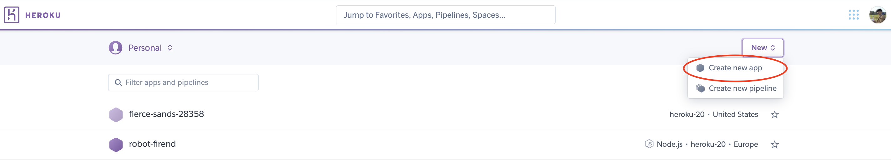

# Heroku

Before we start, you can follow all the intructions of the tutorial on your own machine or here in Katakodas virtual enviroment. When ypu are promted to execute something you will execute it on your preferred machine.

Login into [Heroku](https://id.heroku.com/login).

On the Heroku dashboard, create a new apllication.

-------- 

After creating ypur new application enter the application. On the applications dashboard navigate to the deploy menu. Here you will get intructions on how to deploy your application.

First of 'heroku login'{{execute}}. Follow the instructions on the terminal.

After that, go ahead and run 'heroku git:clone -a robot-friends'{{execute}} to create a new remote herouke branch that we will use to push our changes later. 

After that you will push to the heroku branch by executing:

'git add .'{{execute}}
'git commit -am "make it better"'{{execute}}
'git push heroku master'{{execute}}

After this your application should be deployed on Heroku! 

Congratulations.

