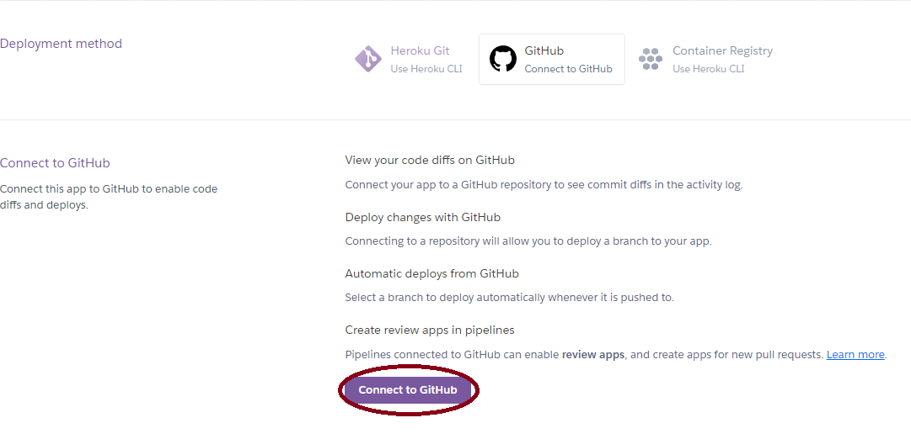
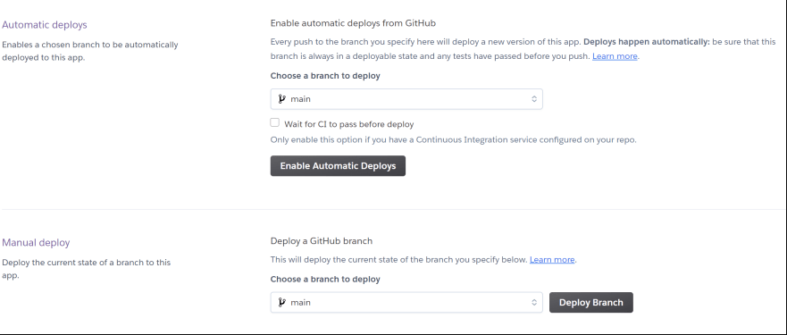

# Auto-deploying
Now that we know how to use Heroku CLI to create, deploy, and manage our app, it's time to set up an auto-deploy feature by connecting Heroku to GitHub.
In order to get this to work, you must connect your github account to your Heroku account. Sadly, at the time of writing this tutorial, this is currently disabled as Heroku has experienced security issues related to this feature. However, we will still show you how to go about setting this up for when they resolve their issues!

This can be done entirely on your browser. Firstly log in to Heroku and navigate to your app.

In the deploy section of your app, choose GitHub. This will show you alternatives for using github to deploy your app.

At this stage you will have to connect your Heroku account to your GitHub account by pressing "Connect to GitHub" as illustrated in the image.

Once you have sucessfully connected your accounts, your view under the github section of the deploy tab should look different. 
You should now have a field where you can search for the name of your repository. Make sure to connect to the correct repo!

You should yet again have a different view once you have connected your Heroku application your GitHub repo.
It should now look something like the following image.

You now have the option to enable automatic deploys, decide what branch to deploy from, and manually deploy from a selected branch in the repo.
One important option is to wait for any CI to pass before deploying. This allows you to viably integrate this into your CI/CD pipeline!

You can now start auto-deploying by simply pushing/merging your new code into the selected branch of your repo. Furthermore, you can also see the history of all builds in the activity tab.
